# PasswordEpic - Secure Mobile Password Manager

## Overview

PasswordEpic is a highly secure mobile password manager built with React Native, featuring enterprise-grade security measures including end-to-end encryption, biometric authentication, and zero-knowledge architecture.

---

## Security Features

### Core Security Implementation

- ✅ **Hardware-backed Encryption**: AES-256-GCM with PBKDF2 key derivation
- ✅ **Biometric Authentication**: Face ID, Touch ID, Fingerprint support
- ✅ **Zero-Knowledge Architecture**: All encryption happens on-device
- ✅ **Multi-factor Authentication**: Gesture + Biometric layers
- ✅ **Memory Protection**: Sensitive data zeroing after use
- ✅ **Anti-Tamper & Root Detection**: Play Integrity API integration
- ✅ **Phishing-Resistant UI**: Watermarks, timestamps, device info
- ✅ **Auto-Wipe Capabilities**: After 30 seconds inactivity or 3 failed attempts
- ✅ **TOTP Support**: Time-based One-Time Password generation
- ✅ **Duress Code**: Emergency vault wipe functionality
- ✅ **Secure Session Management**: Automatic logout & clipboard clearing

---

## Development Plan (6-Week Implementation)

### Week 1: Foundation Setup

**GOAL**: Secure development environment and basic architecture

**Tasks:**

- Set up Android Studio with latest Kotlin & Jetpack Compose
- Configure modular architecture:
  ```
  :app
  ├── :core:security
  ├── :core:crypto
  ├── :data:keystore
  ├── :ui:components
  └── :feature:vault
  ```
- Implement R8/ProGuard obfuscation rules
- Set up dependency injection with Hilt
- Configure build flavors (debug, release, security-test)
- Initialize version control with security hooks

---

### Week 2: Core Security Implementation

**GOAL**: Hardware-backed encryption and biometric authentication

**Android Keystore Integration:**

```kotlin
KeyGenParameterSpec.Builder(
    "vault_master_key",
    PURPOSE_ENCRYPT or PURPOSE_DECRYPT
)
.setBlockModes(KeyProperties.BLOCK_MODE_GCM)
.setEncryptionPaddings(KeyProperties.ENCRYPTION_PADDING_NONE)
.setKeySize(256)
.setUserAuthenticationRequired(true)
.setUserAuthenticationValidityDurationSeconds(30)
.setBoundToHardware(true) // Critical!
.build()
```

**Tasks:**

- Implement BiometricPrompt with phishing-resistant UI
- Add timestamp and device info to auth dialog
- Set authentication validity window (max 30 seconds)
- Implement memory zeroing for sensitive data:
  ```kotlin
  fun clearSensitiveData(data: CharArray) {
      Arrays.fill(data, '\u0000')
  }
  ```

---

### Week 3: Multi-Layer Access Control

**GOAL**: Defense in depth against physical and remote attacks

**Secret Gesture Layer:**

- Implement custom GestureOverlayView
- Store gesture hash using PBKDF2
- Limit gesture attempts (3 max → duress mode)

**Duress Code System:**

- Implement emergency wipe on specific code input
- Create silent alarm functionality
- Test duress mode activation

**Time-based Protection:**

- Auto-wipe after 30 seconds of inactivity
- Session management with automatic logout
- Clipboard auto-clear after 30 seconds

---

### Week 4: Advanced Security Features

**GOAL**: Enterprise-grade security measures

**App Integrity & Anti-Tamper:**

```kotlin
val integrityManager = IntegrityManagerFactory.create(context)
integrityManager.requestIntegrityToken(
    IntegrityTokenRequest.builder()
        .setCloudProjectNumber(cloudProjectNumber)
        .build()
)
```

**Root & Emulator Detection:**

- SafetyNet Attestation
- Root file detection
- Emulator signature checks
- Auto-wipe on compromised environment detection

**Secure UI Implementation:**

- Apply FLAG_SECURE to all windows
- Disable screenshots and screen recording
- Implement secure input fields

---

### Week 5: Encryption & Data Protection

**GOAL**: Zero-knowledge architecture implementation

**Vault Encryption:**

- Implement AES-256-GCM encryption
- Use unique nonce for each encryption operation
- Implement key derivation with PBKDF2

**TOTP Integration:**

- Secure TOTP seed storage (encrypted)
- Implement TOTP code generation
- Auto-refresh codes every 30 seconds

**Secure Storage:**

- Use EncryptedFile for vault storage
- Implement EncryptedSharedPreferences for settings
- Disable Android backup system

---

### Week 6: Testing & Security Audit

**GOAL**: Comprehensive security validation

**Penetration Testing:**

- Frida hooking attempts
- Root bypass testing
- Memory dumping attempts
- Biometric spoofing tests

**Automated Security Scanning:**

- Run MobSF (Mobile Security Framework)
- OWASP Mobile Top 10 checklist
- Code vulnerability scanning

**Real-world Testing:**

- Test on rooted devices
- Test on emulators
- Test backup/restore scenarios
- Test device migration attempts

---

## Security Architecture Summary

### Core Security Principles

- **Zero Trust**: Assume all components are compromised
- **Defense in Depth**: Multiple security layers
- **Least Privilege**: Minimal permissions and access
- **Fail Secure**: Default to secure state on failure

### Critical Implementation Details

| Feature             | Implementation            | Security Level     |
| ------------------- | ------------------------- | ------------------ |
| Key Storage         | Android Keystore + TEE    | 🟢 Hardware-backed |
| Biometric Auth      | Native BiometricPrompt    | 🟢 Protected       |
| Memory Safety       | Manual zeroing            | 🟢 Controlled      |
| Reverse Engineering | R8/ProGuard + Native code | 🟢 Obfuscated      |
| Root Detection      | Play Integrity API        | 🟢 Strong          |
| Device Binding      | setBoundToHardware(true)  | 🟢 Device-locked   |
| App Integrity       | Play Integrity API        | 🟢 Tamper-proof    |

### Additional Security Considerations

- **No Backup**: Set `android:allowBackup="false"` in manifest
- **Secure Flag**: Apply `FLAG_SECURE` to prevent screenshots
- **Memory Zeroing**: Overwrite sensitive data after use
- **No Logging**: Remove all `Log.d` and `Log.e` in release build
- **Disable Debuggable**: Set `android:debuggable=false` in production

---

## Important Notes

⚠️ **DO NOT USE FOR PRODUCTION WITHOUT:**

- Professional security audit
- Bug bounty program
- Continuous security testing and updates

> Remember: Even with these measures, no system is 100% secure. Continuous monitoring, updates, and security improvements are essential.

---

## Quick Reference

**Data Protection**: Every password is encrypted with AES-256-GCM before storage
**Authentication**: Multi-layer (gesture + biometric + timeout)
**Session**: Auto-locks after 30 seconds of inactivity
**Recovery**: Duress code enables emergency data wipe
**Verification**: Play Integrity API ensures app hasn't been tampered with

---

## Workflows and Technical Diagrams

### Reinstall/Login Workflow

This diagram outlines the user flow when they log in after a fresh install or re-install.


---

### Biometric Unlock Flow - Two Scenarios

#### **Scenario 1: Cold Start (App Launches from Scratch)**

When the user opens the app for the first time after installation or a full restart:

```mermaid
%%{init: {'theme': 'dark'}}%%
flowchart TD
    A[App Cold Start] --> B[AppNavigator Checks Auth State]
    B --> C{User Authenticated<br/>& Master Password Set?}
    C -->|Yes| D[Set needsUnlock = true]
    C -->|No| Z[Show Login/Onboarding]

    D --> E[Navigate to AuthNavigator]
    E --> F[MasterPasswordScreen<br/>mode = 'unlock']

    F --> G{Biometric Sensor<br/>Available?}
    G -->|Yes| H[Check shouldNavigateToUnlock Flag]
    G -->|No| M[Show Master Password + PIN Form]

    H --> I{shouldNavigateToUnlock<br/>= true?}
    I -->|Yes - From Resume Fail| M
    I -->|No - Fresh Cold Start| J[Auto-trigger Biometric Prompt]

    J --> K{Biometric<br/>Authentication}
    K -->|✅ Success| L[Generate Static Master Password<br/>Unlock Vault]
    K -->|❌ Fail/Cancel| M

    L --> N[dispatch: setHasCompletedSessionAuth true<br/>dispatch: setShouldNavigateToUnlock false]
    M --> O[User Enters Master Password + PIN]

    N --> P[AppNavigator Detects State Change]
    O --> P
    P --> Q[Navigate to Main Stack]
    Q --> R[PasswordsScreen]

    style J fill:#90EE90,color:#000
    style L fill:#90EE90,color:#000
    style M fill:#1F2020
```



**Key Points:**

- **Auto-trigger biometric once** on MasterPasswordScreen mount
- **No previous biometric attempt** (shouldNavigateToUnlock = false)
- **Clean biometric prompt** → Success → Unlock
- **Fallback available**: Master Password + PIN form if biometric fails

---

#### **Scenario 2: Resume from Background (App Returns to Foreground)**

When the user switches back to the app after it was in the background:


**Key Points:**

- **AppNavigator triggers biometric FIRST** (not MasterPasswordScreen)
- **Single biometric attempt** from AppNavigator
- **shouldNavigateToUnlock flag prevents duplicate prompt**
- **MasterPasswordScreen checks flag** and skips auto-trigger if true
- **Direct fallback to form** if biometric fails in AppNavigator

---

### Flow Comparison Summary

| Aspect                     | Cold Start                         | Resume from Background                        |
| -------------------------- | ---------------------------------- | --------------------------------------------- |
| **Trigger Location**       | MasterPasswordScreen useEffect     | AppNavigator AppState listener                |
| **Biometric Attempts**     | 1 (from MasterPasswordScreen)      | 1 (from AppNavigator)                         |
| **shouldNavigateToUnlock** | false initially                    | Set to true after AppNavigator biometric fail |
| **Duplicate Prevention**   | N/A (first time)                   | Check flag in MasterPasswordScreen            |
| **Fallback Screen**        | Same screen (MasterPasswordScreen) | Navigate to MasterPasswordScreen              |
| **User Experience**        | Load → Biometric → Form (if fail)  | Resume → Biometric → Form (if fail)           |

**Critical Design Decision:**

- `shouldNavigateToUnlock` flag acts as **communication bridge** between AppNavigator and MasterPasswordScreen
- Prevents **double biometric prompt** on resume
- Ensures **clean single-prompt experience** in both scenarios

### PasswordsScreen Interaction Flow

This flowchart details the user interactions available on the main `PasswordsScreen`, which serves as the central hub for managing credentials.


#### Flow Explanation

The `PasswordsScreen` is the primary interface for users to interact with their saved passwords.

- **Core View**: The screen displays a searchable, filterable, and sortable list of password entries (`Password List`).
- **Basic Actions**: Users can `Search` for entries, `Filter` by category, and `Sort` the list (e.g., by title, date).
- **Adding/Editing**:
  - Tapping the `Add New Password Button` navigates to the `AddPasswordScreen`.
  - Tapping an individual entry navigates to the `EditPasswordScreen`.
- **Entry-Level Actions**: Within each list item, users can toggle the password's visibility (`Eye Icon`) or copy it to the clipboard.
- **Bulk Actions**: By activating the `Multi-Select Toggle`, users can select multiple entries to perform bulk actions like `Delete Selected` (which requires confirmation) or `Move Selected to Category`.
- **Data Management**: Buttons for `Export`, `Import`, and `Backup/Restore` trigger their respective modals (`ExportOptionsModal`, `ImportDestinationModal`, `BackupRestoreModal`) to manage vault data.
- **Navigation**: A dedicated button allows navigation to the `SettingsScreen`.

**Summary**: This screen acts as a versatile dashboard, providing comprehensive tools for password management, from simple viewing and editing to advanced bulk operations and data migration.

---

## Encrypted Master Password and PIN Workflow

This section details the cryptographic process for securing the user's data, from Master Password creation to PIN-based unlocking. All operations are designed under a zero-knowledge principle, where the unencrypted Master Password or derived keys are never stored on any server.

### 1. Master Password Key Derivation

When a user sets their Master Password, a strong encryption key is derived from it. This process is intentionally slow to resist brute-force attacks.

- **File Location**: `e:\IT\Mobile\PasswordEpic\src\services\cryptoService.ts`
- **Function**: `deriveKeyFromPassword`

**Process:**

1.  A cryptographically secure, unique 32-byte (256-bit) salt is generated using `generateSalt()`.
2.  The `PBKDF2-HMAC-SHA256` algorithm is used to derive a 256-bit key.
3.  The function performs **10,000 iterations**, making it computationally expensive to guess the password.
4.  The derived key is cached in memory for 60 minutes to improve performance during a session, avoiding the need to re-run the expensive derivation process repeatedly.

```typescript
// Source: e:\IT\Mobile\PasswordEpic\src\services\cryptoService.ts

import CryptoJS from 'crypto-js';

export const CRYPTO_CONSTANTS = {
  PBKDF2_ITERATIONS: 10000,
  // ... other constants
};

export const deriveKeyFromPassword = (
  password: string,
  salt: string,
  iterations: number = CRYPTO_CONSTANTS.PBKDF2_ITERATIONS,
): string => {
  // ... cache logic ...

  const key = CryptoJS.PBKDF2(password, salt, {
    keySize: CRYPTO_CONSTANTS.KEY_LENGTH / 4, // 32 bytes = 256 bits
    iterations: iterations,
    hasher: CryptoJS.algo.SHA256,
  });

  const derivedKey = key.toString(CryptoJS.enc.Hex);
  // ... cache storage ...
  return derivedKey;
};
```

### 2. Individual Password Entry Encryption

Each password entry in the vault is encrypted independently with a unique key, preventing a compromise of one entry from affecting others.

- **File Location**: `e:\IT\Mobile\PasswordEpic\src\services\cryptoService.ts`
- **Functions**: `encryptPasswordEntry`, `encryptData`

**Process:**

1.  The password entry data (title, username, password, etc.) is serialized into a JSON string.
2.  A **new, unique salt** is generated for this specific entry.
3.  The user's Master Password and this new salt are used to derive a unique `entryKey` via the `deriveKeyFromPassword` function.
4.  The JSON data is encrypted using **AES-256-CTR**.
5.  An **HMAC-SHA256** authentication tag is calculated over the resulting ciphertext and the initialization vector (IV). This acts as a "signature" to detect any tampering or corruption of the encrypted data.
6.  The final stored object contains the `encryptedData`, `iv`, `tag`, and `salt`. The plaintext data and the `entryKey` are discarded from memory.

```typescript
// Source: e:\IT\Mobile\PasswordEpic\src\services\cryptoService.ts

export const encryptData = (
  plaintext: string,
  key: string,
  iv?: string,
): { ciphertext: string; iv: string; tag: string } => {
  const initVector = iv || generateIV();
  const keyWordArray = CryptoJS.enc.Hex.parse(key);
  const ivWordArray = CryptoJS.enc.Hex.parse(initVector);

  // Encrypt using AES-CTR
  const encrypted = CryptoJS.AES.encrypt(plaintext, keyWordArray, {
    iv: ivWordArray,
    mode: CryptoJS.mode.CTR,
    padding: CryptoJS.pad.NoPadding,
  });

  // Generate authentication tag using HMAC-SHA256
  const ciphertextHex = encrypted.ciphertext.toString(CryptoJS.enc.Hex);
  const tag = CryptoJS.HmacSHA256(ciphertextHex + initVector, keyWordArray)
    .toString(CryptoJS.enc.Hex)
    .substring(0, CRYPTO_CONSTANTS.TAG_LENGTH * 2);

  return { ciphertext: ciphertextHex, iv: initVector, tag: tag };
};
```

### 3. PIN Setup and Local Unlock

The PIN provides a convenient way to unlock the app without re-entering the full Master Password. The PIN encrypts the Master Password itself and stores it locally.

- **File Location**: `e:\IT\Mobile\PasswordEpic\src\services\pinSecurityService.ts`
- **Function**: `encryptMasterPasswordWithPin`

**Process:**

1.  The user sets a 4-6 digit PIN.
2.  A key is derived from the PIN and a fixed, device-specific salt using the same `deriveKeyFromPassword` function.
3.  This PIN-derived key is used to encrypt the user's **Master Password**.
4.  The encrypted Master Password is stored securely on the device (e.g., using `EncryptedSharedPreferences`).
5.  When the user unlocks the app with their PIN, the locally stored encrypted Master Password is decrypted, allowing access to the vault without requiring another remote authentication or the full Master Password entry.
6.  The service includes a security mechanism that locks PIN entry for 5 minutes after 3 failed attempts.

```typescript
// Source: e:\IT\Mobile\PasswordEpic\src\services\pinSecurityService.ts

encryptMasterPasswordWithPin(
  masterPassword: string,
  userPin: string,
  fixedSalt: string,
): PinEncryptedMasterPassword {
  // ... PIN validation ...

  // Derive encryption key from PIN + salt
  const encryptionKey = deriveKeyFromPassword(userPin, fixedSalt);

  // Encrypt Master Password
  const encrypted = encryptData(masterPassword, encryptionKey);

  return {
    ciphertext: encrypted.ciphertext,
    iv: encrypted.iv,
    tag: encrypted.tag,
  };
}
```

---

## Autofill Authentication Flow

This section summarizes the implementation of the Autofill Authentication Flow, which bridges the React Native and Android Native modules to provide a seamless and secure autofill experience.

### 1. React Native Side (`staticMasterPasswordService.ts`)

- **`setupMasterPasswordWithPin()` updated:**
  - Saves the encrypted master password to `AsyncStorage` (in addition to Firebase).
  - Uses keys: `@encrypted_master_password`, `@encrypted_mp_iv`, `@encrypted_mp_tag`.
  - This allows the Android Native side to access the encrypted data directly for the autofill service.
- **`unlockMasterPasswordWithPin()` updated:**
  - Upon successful unlock within the app, the encrypted data is refreshed in `AsyncStorage`.
  - This ensures the Android Native side always has the latest encrypted master password.

### 2. Android Native Side (`AutofillAuthActivity.kt`)

- **UI Improvements:**
  - `showPinPrompt()`: An `AlertDialog` for PIN entry with a 6-digit limit.
  - `showMasterPasswordAndPinPrompt()`: An `AlertDialog` with clear labels for both Master Password and PIN entry.
  - Improved spacing and layout using `LinearLayout` and `LayoutParams`.
- **Authentication Logic:**
  - `verifyPinAndProceed()`: Decrypts the encrypted master password (retrieved from `AsyncStorage`) using the provided PIN.
  - `verifyMasterPasswordAndPinThenProceed()`: Verifies the master password hash and then decrypts the master password using the PIN.
- **Cryptography Implementation:**
  - `decryptMasterPasswordWithPin()`:
    - Uses `PBKDF2-HMAC-SHA256` (100,000 iterations) to derive a key from the PIN and a stored salt.
    - Performs `HMAC-SHA256` tag verification to ensure data integrity.
    - Uses `AES-256-CTR` to decrypt the master password.
  - `computeHmacSHA256Tag()`: Calculates the authentication tag for verification.
  - `bytesToHex()` / `hexToBytes()`: Helper utilities for data conversion.

### Completed Authentication Flow & Security Features

- **Double Authentication:** Biometric + PIN or Master Password + PIN.
- **Encrypted Storage:** The master password is encrypted with the PIN and stored in `AsyncStorage` for quick access by the autofill service.
- **Tag Verification:** `HMAC-SHA256` ensures data integrity against tampering.
- **PBKDF2 Key Derivation:** 100,000 iterations protect against brute-force attacks on the PIN.
- **AES-256-CTR Encryption:** Industry-standard symmetric encryption.
- **No Plaintext Storage:** The master password is never stored in plaintext on the device.

### Autofill Workflow Diagram


### Next Steps for Testing

1.  Open the React Native app and unlock with the PIN. This will save the encrypted Master Password to `AsyncStorage`.
2.  Test the autofill feature in another app (e.g., Chrome, a social media app).
3.  Verify the following authentication flows:
    - ✅ Biometric → PIN → Fill password.
    - ✅ Biometric (cancelled) → Master Password + PIN → Fill password.

---

## Autofill Authentication Flow - Complete Documentation

### Overview

This section provides comprehensive documentation about the autofill authentication flow in PasswordEpic, focusing on the two-factor authentication system (Biometric + PIN) and the data sharing architecture between React Native and Android Native layers.

### Table of Contents

1. [Authentication Flow](#autofill-authentication-flow-1)
2. [Storage Architecture](#autofill-storage-architecture)
3. [Encryption & Decryption](#autofill-encryption--decryption)
4. [Data Sharing Between Layers](#autofill-data-sharing-between-layers)
5. [Critical Design Decisions](#autofill-critical-design-decisions)
6. [Testing Checklist](#autofill-testing-checklist)

---

## Autofill Authentication Flow

### Primary Flow: Biometric → PIN → Fill


### Detailed Phase-by-Phase Flow

#### Phase 1: Setup & Caching (React Native Layer)


#### Phase 2: Autofill Trigger (Android Native Layer)


#### Phase 3: Authentication (Two-Factor)


#### Phase 4: Decryption & Fill


---

## Autofill Storage Architecture

### Storage Locations

PasswordEpic uses **three distinct storage systems** to handle data across different process boundaries:

#### 1. AsyncStorage (React Native - SQLite)

**Location**: `/data/data/com.passwordepic.mobile/databases/RKStorage`

**Type**: SQLite database (React Native only)

**Access**: Only accessible from React Native JavaScript layer

**Purpose**: Primary storage for React Native app data

**Data Stored**:

- `encrypted_master_password_data`: JSON object containing:
  - `encryptedMasterPassword`: Base64-encoded encrypted master password
  - `iv`: Base64-encoded initialization vector (16 bytes)
  - `tag`: Base64-encoded authentication tag (16 bytes)
  - `fixedSalt`: Base64-encoded salt (32 bytes)

**Limitation**: Cannot be accessed from Android Native autofill service (different process)

#### 2. SharedPreferences (Android Native)

**Location**: `/data/data/com.passwordepic.mobile/shared_prefs/autofill_encrypted_data.xml`

**Type**: XML key-value store

**Access**: Accessible from both React Native (via native module) and Android Native (direct)

**Purpose**: Bridge data between React Native and Android Native autofill service

**Data Stored** (6 keys):

```xml
<map>
    <string name="encrypted_master_password">Base64EncodedData</string>
    <string name="encrypted_mp_iv">Base64EncodedData</string>
    <string name="encrypted_mp_tag">Base64EncodedData</string>
    <string name="fixed_salt">Base64EncodedData</string>
    <string name="user_id">Firebase_UID</string>
    <string name="user_email">user@example.com</string>
</map>
```

**Key Feature**: Inter-process communication - allows autofill service to access cached data

#### 3. SQLite Database (Credentials)

**Location**: `/data/data/com.passwordepic.mobile/databases/password_epic.db`

**Type**: SQLite database (encrypted credentials)

**Access**: Android Native autofill service

**Purpose**: Store encrypted user credentials

**Data Stored**:

- Table: `passwords`
- Columns: `id`, `title`, `username`, `password` (encrypted), `url`, `notes`, etc.

---

## Autofill Encryption & Decryption

### Cryptographic Specifications

| Component      | Algorithm          | Parameters                      | Output             |
| -------------- | ------------------ | ------------------------------- | ------------------ |
| Key Derivation | PBKDF2-HMAC-SHA256 | 10,000 iterations, 32 bytes key | Encryption key     |
| Encryption     | AES-256-CTR        | 16-byte IV                      | Ciphertext         |
| Authentication | HMAC-SHA256        | First 16 bytes                  | Authentication tag |
| Salt           | Random bytes       | 32 bytes                        | Fixed per user     |

### Master Password Encryption (React Native)

**File**: `src/services/staticMasterPasswordService.ts`

**Process**:

1. User sets master password
2. Generate random 32-byte salt (if not exists)
3. Derive encryption key: `PBKDF2(masterPassword, salt, 10000, 32)`
4. Generate random 16-byte IV
5. Encrypt with AES-256-CTR
6. Generate HMAC-SHA256 tag (first 16 bytes)
7. Save to Firebase: `{ encryptedMasterPassword, iv, tag, fixedSalt }`

### Master Password Decryption (Kotlin)

**File**: `android/app/src/main/java/com/passwordepic/mobile/autofill/AutofillAuthActivity.kt`

**Function**: `decryptMasterPasswordWithPin(pin: String)`

**Process**:

```kotlin
// 1. Read encrypted data from SharedPreferences
val encryptedMPBase64 = prefs.getString("encrypted_master_password", null)
val ivBase64 = prefs.getString("encrypted_mp_iv", null)
val tagBase64 = prefs.getString("encrypted_mp_tag", null)
val saltBase64 = prefs.getString("fixed_salt", null)

// 2. Decode from Base64
val encryptedMP = Base64.decode(encryptedMPBase64, Base64.DEFAULT)
val iv = Base64.decode(ivBase64, Base64.DEFAULT)
val tag = Base64.decode(tagBase64, Base64.DEFAULT)
val salt = Base64.decode(saltBase64, Base64.DEFAULT)

// 3. Derive decryption key using PBKDF2
val factory = SecretKeyFactory.getInstance("PBKDF2WithHmacSHA256")
val spec = PBEKeySpec(pin.toCharArray(), salt, 10000, 256)
val tmp = factory.generateSecret(spec)
val secretKey = SecretKeySpec(tmp.encoded, "AES")

// 4. Decrypt using AES-CTR
val cipher = Cipher.getInstance("AES/CTR/NoPadding")
cipher.init(Cipher.DECRYPT_MODE, secretKey, IvParameterSpec(iv))
val decryptedBytes = cipher.doFinal(encryptedMP)

// 5. Verify HMAC authentication tag
val mac = Mac.getInstance("HmacSHA256")
mac.init(SecretKeySpec(secretKey.encoded, "HmacSHA256"))
val computedTag = mac.doFinal(encryptedMP).copyOfRange(0, 16)
if (!computedTag.contentEquals(tag)) {
    throw SecurityException("Authentication tag mismatch")
}

// 6. Return decrypted master password
return String(decryptedBytes, Charsets.UTF_8)
```

### Static Master Password Generation

**Critical Design Decision**: Credentials are encrypted with a **static master password**, not the user's actual master password.

**Formula**:

```kotlin
val userId = prefs.getString("user_id", null) // Firebase UID
val userEmail = prefs.getString("user_email", "anonymous")
val saltPrefix = fixedSalt.substring(0, 16)
val staticMasterPassword = "$userId::$userEmail::$saltPrefix"
```

**Example**:

```
userId: abc123xyz
userEmail: user@example.com
saltPrefix: a1b2c3d4e5f6g7h8
Result: "abc123xyz::user@example.com::a1b2c3d4e5f6g7h8"
```

**Why Static Password?**

- Allows user to change their master password without re-encrypting all credentials
- Deterministic: Always generates the same password for the same user
- Unique: Different for each user (based on UID and email)

### Credential Decryption

**File**: `AutofillAuthActivity.kt`

**Function**: `decryptCredentialPassword(encryptedPassword: String, salt: String)`

**Process**:

1. Use **static master password** (not user's actual master password)
2. Apply same PBKDF2 + AES-CTR + HMAC process
3. Return decrypted credential password

---

## Autofill Data Sharing Between Layers

### Dual-Write Strategy

When user unlocks the app with biometric, the app performs **dual-write**:

```typescript
// src/services/staticMasterPasswordService.ts
async function cacheEncryptedMasterPasswordToAsyncStorage() {
  // 1. Fetch from Firebase
  const doc = await firestore()
    .collection('user_master_passwords')
    .doc(userId)
    .get();

  const data = doc.data();

  // 2. Save to AsyncStorage (React Native)
  await AsyncStorage.setItem(
    'encrypted_master_password_data',
    JSON.stringify(data),
  );

  // 3. Save to SharedPreferences (Android Native)
  await SharedPreferencesModule.saveEncryptedData({
    encryptedMasterPassword: data.encryptedMasterPassword,
    iv: data.iv,
    tag: data.tag,
    fixedSalt: data.fixedSalt,
    userId: currentUser.uid,
    userEmail: currentUser.email || 'anonymous',
  });
}
```

### Native Module Bridge

**File**: `android/app/src/main/java/com/passwordepic/mobile/SharedPreferencesModule.kt`

**Purpose**: Bridge React Native to Android SharedPreferences

**Methods**:

#### `saveEncryptedData(data: ReadableMap)`

```kotlin
@ReactMethod
fun saveEncryptedData(data: ReadableMap) {
    val prefs = reactContext.getSharedPreferences(
        "autofill_encrypted_data",
        Context.MODE_PRIVATE
    )
    val editor = prefs.edit()

    // Save 6 keys
    if (data.hasKey("encryptedMasterPassword")) {
        editor.putString("encrypted_master_password",
            data.getString("encryptedMasterPassword"))
    }
    if (data.hasKey("iv")) {
        editor.putString("encrypted_mp_iv", data.getString("iv"))
    }
    if (data.hasKey("tag")) {
        editor.putString("encrypted_mp_tag", data.getString("tag"))
    }
    if (data.hasKey("fixedSalt")) {
        editor.putString("fixed_salt", data.getString("fixedSalt"))
    }
    if (data.hasKey("userId")) {
        editor.putString("user_id", data.getString("userId"))
    }
    if (data.hasKey("userEmail")) {
        editor.putString("user_email", data.getString("userEmail"))
    }

    editor.apply()
}
```

#### `getEncryptedData(promise: Promise)`

```kotlin
@ReactMethod
fun getEncryptedData(promise: Promise) {
    val prefs = reactContext.getSharedPreferences(
        "autofill_encrypted_data",
        Context.MODE_PRIVATE
    )

    val map = Arguments.createMap()
    map.putString("encryptedMasterPassword",
        prefs.getString("encrypted_master_password", null))
    map.putString("iv", prefs.getString("encrypted_mp_iv", null))
    map.putString("tag", prefs.getString("encrypted_mp_tag", null))
    map.putString("fixedSalt", prefs.getString("fixed_salt", null))
    map.putString("userId", prefs.getString("user_id", null))
    map.putString("userEmail", prefs.getString("user_email", null))

    promise.resolve(map)
}
```

### Data Flow Summary


**Key Points**:

- **Firebase**: Source of truth for encrypted master password
- **AsyncStorage**: React Native primary storage (isolated process)
- **SharedPreferences**: Bridge storage (accessible by autofill service)
- **Credentials DB**: Stores encrypted credentials (accessed by autofill)

---

## Autofill Critical Design Decisions

### 1. Why SharedPreferences Instead of AsyncStorage?

**Problem**: Android Autofill service runs in a separate process and cannot access AsyncStorage (SQLite RKStorage database).

**Solution**: Use SharedPreferences as a bridge because:

- Accessible from multiple processes
- Simple key-value storage (perfect for cached data)
- Fast read/write operations
- No need for complex database queries

### 2. Why Static Master Password?

**Problem**: If credentials are encrypted with the user's actual master password, changing the master password requires re-encrypting all credentials (expensive operation).

**Solution**: Use a deterministic static password based on:

- User ID (Firebase UID) - unique per user
- User email - additional uniqueness
- Salt prefix (first 16 chars) - adds entropy

**Benefits**:

- User can change their master password anytime without re-encrypting credentials
- Each user has a unique static password
- Deterministic: Always generates the same password for the same user

### 3. Why Two-Factor Authentication (Biometric + PIN)?

**Security Reasoning**:

- **Biometric**: Convenient, fast, user-friendly
- **PIN**: Additional layer of security, prevents unauthorized access if biometric is compromised
- **Master Password Fallback**: Ensures access if biometric fails

### 4. Why Dual-Write Strategy?

**Reasoning**:

- **AsyncStorage**: Required for React Native app functionality
- **SharedPreferences**: Required for Android Native autofill service
- **Dual-write**: Ensures both layers have access to the same data

### 5. Why PBKDF2 with 10,000 Iterations?

**Security vs Performance Balance**:

- **10,000 iterations**: Standard recommended by OWASP
- **32 bytes key length**: AES-256 requirement
- **SHA-256**: Industry standard, widely supported
- **Performance**: Fast enough for mobile devices (<100ms)

---

## Autofill Testing Checklist

### Setup Phase

- [ ] User opens app for the first time
- [ ] User sets master password and PIN
- [ ] User enables biometric authentication
- [ ] App saves encrypted master password to Firebase
- [ ] App caches encrypted data to AsyncStorage
- [ ] App caches encrypted data to SharedPreferences via native module

### Verify Caching

- [ ] Check logcat for: "✅ Encrypted MP also saved to SharedPreferences"
- [ ] Verify SharedPreferences file exists: `adb shell cat /data/data/com.passwordepic.mobile/shared_prefs/autofill_encrypted_data.xml`
- [ ] Verify 6 keys are present: encrypted_master_password, encrypted_mp_iv, encrypted_mp_tag, fixed_salt, user_id, user_email

### Autofill Flow - Primary Path (Biometric → PIN)

- [ ] Open browser (Chrome) or any app
- [ ] Navigate to login page (e.g., github.com/login)
- [ ] Tap on username or password field
- [ ] See credential list from PasswordEpic
- [ ] Tap on a credential
- [ ] Biometric prompt appears
- [ ] Provide fingerprint → Success
- [ ] PIN prompt appears (6-digit input with proper spacing)
- [ ] Enter correct PIN
- [ ] See success message: "✅ PIN verified and static master password generated"
- [ ] See: "✅ Deriving decryption key from master password + salt..."
- [ ] See: "✅ Authentication tag verified for credential"
- [ ] See: "✅ Credential password decrypted successfully"
- [ ] Credential fills into the app
- [ ] AutofillAuthActivity closes

### Autofill Flow - Fallback Path (Master Password + PIN)

- [ ] Tap on credential
- [ ] Biometric prompt appears
- [ ] Press Cancel or provide wrong fingerprint 5 times
- [ ] See Master Password + PIN fallback prompt
- [ ] Enter correct master password and PIN
- [ ] Credential decrypts and fills successfully

### Error Cases

- [ ] Enter wrong PIN → See error message and retry prompt
- [ ] Enter wrong master password in fallback → See error message
- [ ] Cancel biometric without fallback → Activity closes, no fill

### Logs Verification

**Expected logs on successful autofill**:

```
D/AutofillAuthActivity: Reading encrypted data from SharedPreferences...
D/AutofillAuthActivity: ✅ Found encrypted master password data
D/AutofillAuthActivity: Encrypted MP length: 44, IV length: 24, Tag length: 24, Salt length: 44
D/AutofillAuthActivity: User ID: abc123xyz, Email: user@example.com
D/AutofillAuthActivity: ℹ️ Using PIN for decryption
D/AutofillAuthActivity: ✅ Decryption setup complete
D/AutofillAuthActivity: ✅ PIN verified and static master password generated
D/AutofillAuthActivity: Static master password: abc123xyz::user@example.com::a1b2c3d4e5f6g7h8
D/AutofillAuthActivity: ✅ Deriving decryption key from master password + salt...
D/AutofillAuthActivity: ✅ Cipher initialized for decryption
D/AutofillAuthActivity: ✅ Decryption completed
D/AutofillAuthActivity: ✅ Authentication tag verified for credential
D/AutofillAuthActivity: ✅ Credential password decrypted successfully
D/AutofillAuthActivity: ✅ Filling credential: username@example.com
```

---

## Autofill Technical Architecture Summary

### Component Overview


### File Structure

```
PasswordEpic/
├── src/
│   ├── services/
│   │   └── staticMasterPasswordService.ts   # Master password encryption & caching
│   └── App.tsx                               # Biometric unlock callback
├── android/
│   └── app/src/main/java/com/passwordepic/mobile/
│       ├── SharedPreferencesModule.kt        # Native module bridge
│       ├── PasswordEpicPackage.kt            # Register native module
│       ├── MainApplication.kt                # App initialization
│       └── autofill/
│           └── AutofillAuthActivity.kt       # Autofill authentication logic
└── PasswordEpic.md                           # This documentation
```

---

## Autofill Troubleshooting

### Common Issues

#### 1. Autofill not showing credential list

**Cause**: Autofill service not enabled
**Solution**: Settings → System → Languages & input → Autofill service → PasswordEpic

#### 2. Biometric prompt doesn't appear

**Cause**: Biometric not enrolled or permission denied
**Solution**: Settings → Security → Fingerprint → Add fingerprint

#### 3. PIN decryption fails

**Possible causes**:

- Wrong PIN entered
- Cached data not present in SharedPreferences
- Crypto parameters mismatch

**Debug steps**:

```bash
# Check SharedPreferences
adb shell cat /data/data/com.passwordepic.mobile/shared_prefs/autofill_encrypted_data.xml

# Check logcat
adb logcat -s AutofillAuthActivity:D
```

#### 4. Credential decryption fails with "Authentication tag mismatch"

**Cause**: Using wrong master password (user's actual password instead of static password)
**Solution**: Verify static master password generation in `verifyPinAndProceed()`:

```kotlin
val staticMasterPassword = "$userId::$userEmail::$saltPrefix"
decryptedMasterPassword = staticMasterPassword // Must use static, not user's password
```

#### 5. "Encrypted master password data not found"

**Cause**: User hasn't unlocked app with biometric after updating code
**Solution**:

1. Open PasswordEpic app
2. Unlock with biometric
3. Check logcat for: "✅ Encrypted MP also saved to SharedPreferences"
4. Try autofill again

---

## Autofill Security Considerations

### Data Protection

1. **Master Password**: Never stored in plaintext

   - Encrypted with PIN-derived key (PBKDF2)
   - Stored in both AsyncStorage and SharedPreferences
   - Authentication tag prevents tampering

2. **PIN**: Never stored

   - Used only for key derivation
   - User must enter each time

3. **Static Master Password**: Generated deterministically

   - Not stored anywhere
   - Regenerated each time from userId + userEmail + salt
   - Used only in memory during credential decryption

4. **Credential Passwords**: Encrypted with static master password
   - Stored in SQLite database
   - Each has unique salt
   - HMAC authentication prevents tampering

### Process Isolation

- React Native runs in main app process
- Autofill service runs in separate system process
- SharedPreferences enables secure inter-process communication
- No shared memory or direct process communication

### Key Rotation

**If user changes master password**:

1. User's encrypted master password is updated in Firebase
2. Cache is refreshed in AsyncStorage and SharedPreferences
3. Static master password remains the same (unchanged)
4. Credentials don't need re-encryption

**If user changes email**:

1. Static master password changes
2. All credentials must be re-encrypted (expensive operation)
3. Recommended: Prevent email changes or implement background migration

---

## Autofill Version History

| Version | Date       | Changes                                                                 |
| ------- | ---------- | ----------------------------------------------------------------------- |
| 1.0     | 2025-01-15 | Initial implementation - Biometric → Fill flow                          |
| 2.0     | 2025-01-20 | Added PIN prompt after biometric success                                |
| 2.1     | 2025-01-22 | Added master password + PIN fallback                                    |
| 2.2     | 2025-01-25 | Implemented SharedPreferences caching                                   |
| 2.3     | 2025-01-27 | Fixed crypto parameters (32 bytes, 10k iterations)                      |
| 2.4     | 2025-01-28 | Removed service binding, direct decryption                              |
| 3.0     | 2025-01-30 | **Current** - Static master password generation with userId & userEmail |

---

## Autofill Implementation Summary

PasswordEpic implements a sophisticated two-factor autofill authentication system that balances security, usability, and performance. The dual-storage architecture enables seamless data sharing between React Native and Android Native layers while maintaining process isolation and security.

Key achievements:

- ✅ Two-factor authentication (Biometric + PIN)
- ✅ Master password fallback
- ✅ Cross-process data sharing via SharedPreferences
- ✅ Static master password for efficient password changes
- ✅ Industry-standard encryption (PBKDF2, AES-256, HMAC-SHA256)
- ✅ Comprehensive error handling and logging

For questions or issues, refer to the [Autofill Testing Checklist](#autofill-testing-checklist) and [Autofill Troubleshooting](#autofill-troubleshooting) sections.

---

## Biometric PIN Fallback for Delete Operations

### Overview

**PIN Fallback is ONLY enabled for DELETE operations**. Unlock and autofill use biometric-only with eye icon fallback (existing flow).

### Why DELETE Operations Only?

- **Unlock & Autofill**: Already have eye icon → master password fallback
- **DELETE Operations**: Destructive actions → need easier authentication option
- **User Experience**: Prevents lockout from delete functionality if biometric fails

### Workflow

```mermaid
flowchart TD
    A[User taps Delete<br/>Password/File/Backup] --> B{Biometric Available?}
    B -->|Yes| C[Show Biometric Prompt]
    B -->|No| D[Show Error]

    C --> E{Authentication Options}
    E -->|👆 Use Biometric| F{Biometric Success?}
    E -->|🔢 Use PIN/Pattern| G[Device PIN Screen]

    F -->|✅ Success| H[Delete Confirmed]
    F -->|❌ Failed| C

    G --> I{PIN Correct?}
    I -->|✅ Correct| H
    I -->|❌ Wrong| G

    E -->|❌ Cancel| D[Operation Cancelled]

    H --> J[Show Confirmation Dialog]
    J --> K{User Confirms?}
    K -->|Yes| L[Delete Item]
    K -->|No| D
```



### Implementation Details

**Default Behavior:**

- Biometric authentication: `allowDeviceCredentials = false` (biometric only)
- Delete operations: `allowDeviceCredentials = true` (biometric + PIN fallback)

**Protected Operations:**

1. Password deletion (from list and edit screen)
2. Import file deletion (local, Google Drive, Google Hidden)
3. Backup deletion (from PasswordsScreen and SettingsScreen)

**Code Example:**

```typescript
// For DELETE operations - Enable PIN fallback
const handlePasswordDelete = async (password: Password) => {
  const biometricResult = await authenticateBiometric(
    'Authenticate to delete password',
    true, // ← Enable PIN/Pattern fallback
  );

  if (!biometricResult) {
    showAlert(
      'Authentication Failed',
      'Authentication is required to delete passwords',
    );
    return;
  }

  // Proceed with delete...
};
```

**Native Android Implementation:**

```kotlin
@ReactMethod
fun authenticateWithCredentialFallback(
    title: String,
    subtitle: String,
    description: String,
    cancelButtonText: String,
    preference: String,
    promise: Promise
) {
    // Authenticator flags include DEVICE_CREDENTIAL
    val authenticators = BiometricManager.Authenticators.BIOMETRIC_STRONG or
                       BiometricManager.Authenticators.BIOMETRIC_WEAK or
                       BiometricManager.Authenticators.DEVICE_CREDENTIAL

    // System automatically shows "Use PIN/Pattern" button
    val promptInfo = BiometricPrompt.PromptInfo.Builder()
        .setTitle(title)
        .setSubtitle(subtitle)
        .setDescription(description)
        .setAllowedAuthenticators(authenticators)
        .setConfirmationRequired(false)
        .build()

    biometricPrompt.authenticate(promptInfo)
}
```

### Security Notes

✅ **PIN Fallback Enabled (Delete Operations)**

- Better UX: Users not locked out if biometric fails
- OS-level security: Device PIN is already secure
- Industry standard: Banking apps use this pattern

🔒 **Biometric Only (Unlock & Autofill)**

- Eye icon → Master password fallback
- More secure for sensitive operations
- Existing proven flow

---

## Import/Export/Backup/Restore Workflows

This section documents the four data management workflows in PasswordEpic, based on actual implementation files:

- **File Locations**: `src/services/importExportService.ts` & `src/services/backupService.ts`

### Understanding App Data Folder (Important Context)

**App Data Folder** is a secure, isolated directory on Android where apps can store private files without requiring sensitive permissions:

- **Path**: `/storage/emulated/0/Android/data/<package_name>/files/`
- **Privacy**: Only PasswordEpic app can access (even file manager cannot browse it without special permissions)
- **Permissions**: Uses standard WRITE_EXTERNAL_STORAGE (non-sensitive in app-specific directory)
- **Lifecycle**: Automatically deleted when app is uninstalled
- **Use Case**: Perfect for export files - secure by default, no cloud dependency

This is why we recommend "Local Storage" as the default for export files - it provides the highest level of security without requiring any special cloud permissions.

---

### 1. EXPORT Workflow

**Purpose**: Manual export of passwords to file (double-encrypted JSON format)

**File**: `src/services/importExportService.ts` - `exportPasswords()` method (lines 902-990)

**Key Points**:

- **Double Encryption**: Entries already encrypted + entire file encrypted with master password
- Uses **master password** + `EXPORT_KEY_CONSTANT` to generate entry encryption key
- **File-Level Encryption**: Entire export wrapper encrypted using `masterPassword::FILE_EXPORT_::<EXPORT_KEY_CONSTANT>`
- Exports entries with encryption metadata intact (salt/iv/authTag preserved)
- **Minimal Metadata**: No sensitive debug info exposed (v3.0 format)
- User chooses storage location (see Storage Options below)

#### Export Flow


#### Double Encryption Structure

**Entry Level** (already encrypted in database):

```typescript
{
  password: "U2FsdGVkX1...",  // AES-256-GCM encrypted
  salt: "hex_string",          // Original salt
  iv: "hex_string",            // Original IV
  authTag: "hex_string"        // Authentication tag
}
```

**File Level** (new in v3.0):

```typescript
{
  _fileEncryption: true,
  _version: "3.0",
  _encryptionMethod: "AES-256-CBC",
  _data: "U2FsdGVkX1..."  // ← Entire JSON encrypted with master password
}
```

#### How Export Encryption Works

```typescript
// src/services/importExportService.ts - lines 50-67, 1536-1560
const EXPORT_KEY_CONSTANT = '920374798$gsdg9@#875982kldsf';

// Entry-level: master password + fixed constant
const exportKey = `${masterPassword}::${EXPORT_KEY_CONSTANT}`;

// File-level: master password + FILE_EXPORT prefix + fixed constant
const fileEncryptionKey = `${masterPassword}::FILE_EXPORT_${EXPORT_KEY_CONSTANT}`;

// Full export encrypted with file key
const encrypted = CryptoJS.AES.encrypt(
  jsonContent,
  fileEncryptionKey,
).toString();
```

#### What Gets Exported (v3.0)

Minimal metadata for security:

```typescript
exportInfo: {
  exportDate: "2025-11-19T...",
  format: "PasswordEpic JSON Export",
  version: "3.0",
  isEncrypted: true,
  encryptionMethod: "Master Password + AES-256",
  totalEntries: 42,
  warning: "🔐 Passwords are encrypted with your Master Password using AES-256"
}
```

**Important**:

- Entire file is encrypted - attackers cannot read any content without master password
- No export keys or hashes exposed in metadata
- Entries preserved with original encryption to avoid re-encryption on import

---

### 2. IMPORT Workflow

**Purpose**: Import passwords from exported file back into vault (auto-decrypts file-level encryption)

**File**: `src/services/importExportService.ts` - `importPasswords()` method (lines 633-899)

**Key Points**:

- **Auto-Decryption**: Detects and decrypts file-level encryption (v3.0) using master password
- For **encrypted entries** (has salt/iv/authTag): Restore as-is without decrypt/re-encrypt cycle
- For **plaintext entries**: Encrypt with current master password before saving
- Supports merge/replace modes
- Handles duplicate detection

#### Import Flow


#### Encrypted Entry Restoration (Key Feature)

```typescript
// src/services/importExportService.ts - lines 804-842
if (rawEntry.salt && rawEntry.iv && rawEntry.authTag && rawEntry.password) {
  // OPTIMIZED: Entry is already encrypted in export format
  // Restore directly without decrypt/re-encrypt cycle

  await encryptedDatabase.savePasswordEntryWithEncryptedData(entry, {
    ciphertext: rawEntry.password, // Already encrypted
    salt: rawEntry.salt, // Original salt
    iv: rawEntry.iv, // Original IV
    tag: rawEntry.authTag, // Authentication tag
  });
  // Entry saved to DB with original encryption intact
}
```

#### Plaintext Entry Handling

```typescript
// src/services/importExportService.ts - lines 843-855
else {
  // Plaintext entry or from other format
  // Need to encrypt before storage

  if (!masterPassword) {
    throw new Error(`Cannot encrypt plaintext entry without master password`);
  }

  await encryptedDatabase.savePasswordEntry(
    entry,
    masterPassword,  // Uses current master password for encryption
  );
}
```

---

### 2.5. Storage Options for Export/Import

Users can choose where to save/load exported password files. Each option has different privacy and accessibility characteristics:

#### 📁 Option 1: Local Storage (App Data Folder)

**Default: Recommended for privacy**

- **Location**: `/storage/emulated/0/Android/data/com.passwordepic.mobile/files/` (Android)
- **Permission**: No sensitive permissions needed (app-specific directory)
- **Accessibility**: Private to PasswordEpic app only
- **Best For**: Daily backups, sensitive environments
- **Recovery**: Easy to find in file manager under app data
- **Pros**: Maximum privacy, automatic cleanup when app uninstalled, no cloud exposure
- **Cons**: Lost if app or device storage reset

#### ☁️ Option 2: Google Drive

**For cloud sync and cross-device access**

- **Location**: User's Google Drive account (`/root/PasswordEpic/exports/`)
- **Permission**: Requires Google Drive API access (user grants access once)
- **Accessibility**: Available on all devices where user is signed in
- **Best For**: Multi-device syncing, cloud backup
- **Recovery**: Can restore from Google Drive on new device
- **Pros**: Cross-device availability, cloud-backed up by Google, easy sharing
- **Cons**: Requires internet, Google account dependency, slight latency

#### 🔐 Option 3: Hidden Google (App Private Folder)

**Most secure cloud option**

- **Location**: Google Drive `/appDataFolder/PasswordEpic/` (hidden from user, app-managed)
- **Permission**: Requires Google Drive API (user grants access once)
- **Accessibility**: Only accessible via PasswordEpic app (not in user's regular Drive)
- **Best For**: Automated backups, emergency recovery
- **Recovery**: Only through PasswordEpic import function
- **Pros**: Hidden from casual browsing, automatic management by app, secure cloud storage
- **Cons**: Cannot manually browse via Google Drive web interface, requires app to access

#### Storage Option Comparison

| Feature               | Local        | Google Drive | Hidden Google      |
| --------------------- | ------------ | ------------ | ------------------ |
| **Privacy**           | ⭐⭐⭐⭐⭐   | ⭐⭐⭐       | ⭐⭐⭐⭐⭐         |
| **Accessibility**     | Device only  | All devices  | App only           |
| **No permissions**    | ✅           | ❌           | ❌                 |
| **Cloud sync**        | ❌           | ✅           | ✅                 |
| **Manual browse**     | ✅           | ✅           | ❌                 |
| **Internet required** | ❌           | ✅           | ✅                 |
| **Best use case**     | Daily backup | Multi-device | Emergency recovery |

---

### 3. BACKUP Workflow

**Purpose**: Cloud backup to local file storage (Google Drive ready)

**File**: `src/services/backupService.ts` - `createBackup()` method (lines 132-236)

**Key Points**:

- Uses fixed `BACKUP_ENCRYPTION_KEY` constant (line 16)
- **No master password needed** for backup creation
- Entries stored with encryption metadata (salt/iv/authTag)
- Supports optional compression
- Unencrypted metadata prefix for quick info reading

#### Backup File Structure

```
┌─────────────────────────────────┐
│ METADATA_V1:<base64>||| ← Unencrypted metadata prefix
├─────────────────────────────────┤
│ ENCRYPTED_V1:<encrypted_data>   ← Encrypted backup content
└─────────────────────────────────┘
```

#### Backup Flow


#### What Gets Backed Up

```typescript
// src/services/backupService.ts - lines 612-752
interface BackupData {
  version: string; // "1.0"
  timestamp: Date; // Backup timestamp
  entries: BackupPasswordEntry[]; // All passwords (encrypted with salt/iv/authTag)
  categories: PasswordCategory[]; // All categories
  settings: any; // User settings (if includeSettings: true)
  domains: any[]; // Trusted domains list
  metadata: BackupMetadata; // Backup info
}

interface BackupMetadata {
  appVersion: string; // App version
  platform: string; // OS info
  deviceId: string; // Device identifier
  entryCount: number; // # of passwords
  categoryCount: number; // # of categories
  encryptionMethod: string; // "AES-256-GCM" or "none"
  compressionMethod: string; // "gzip" or "none"
  backupSize: number; // File size
}
```

#### Entry Preservation in Backup

```typescript
// src/services/backupService.ts - lines 633-663
const processedEntries = entries.map(entry => {
  const encryptedEntry = encryptedEntries.find(e => e.id === entry.id);

  if (encryptedEntry) {
    // Use encrypted data as-is from database
    return {
      ...entry,
      password: encryptedEntry.encryptedData, // Ciphertext
      salt: encryptedEntry.salt, // Original salt
      iv: encryptedEntry.iv, // Original IV
      authTag: encryptedEntry.authTag, // Auth tag
      isPasswordEncrypted: true,
    };
  }
});
```

---

### 4. RESTORE Workflow

**Purpose**: Restore from backup file to recover password vault

**File**: `src/services/backupService.ts` - `restoreFromBackup()` method (lines 238-421)

**Key Points**:

- Reads backup file (handles base64 decoding from cloud downloads)
- Extracts unencrypted metadata for display
- Decrypts with fixed `BACKUP_ENCRYPTION_KEY` (no master password needed)
- Entries already encrypted, restored as-is

#### Restore Flow


#### Base64 Handling

```typescript
// src/services/backupService.ts - lines 250-275
// Files downloaded from cloud may be base64 encoded
const base64Pattern = /^[A-Za-z0-9+/=\s\r\n]*$/;
const trimmedContent = content.trim();

if (base64Pattern.test(trimmedContent)) {
  try {
    const cleanBase64 = trimmedContent.replace(/\s/g, '');
    const decoded = Buffer.from(cleanBase64, 'base64').toString('utf8');

    if (
      (decoded.includes('{') || decoded.includes('[')) &&
      !content.includes('ENCRYPTED_V1:') &&
      content.length !== decoded.length
    ) {
      content = decoded; // Use decoded version
    }
  } catch (decodeError) {
    // Continue with original content
  }
}
```

#### Entry Restoration

```typescript
// src/services/backupService.ts - lines 359-366
// IMPORTANT: Entries in backup are already encrypted
// No decrypt/re-encrypt needed

const processedEntries = this.processRestoredEntries(
  backupData.entries,
  options, // Includes mergeStrategy
);

// All entries will have their original salt/iv/authTag preserved
// They're immediately usable after restoration
```

---

## Detailed Workflows Comparison

| Aspect                    | Export                       | Import                       | Backup                 | Restore                |
| ------------------------- | ---------------------------- | ---------------------------- | ---------------------- | ---------------------- |
| **File Location**         | `importExportService.ts:902` | `importExportService.ts:633` | `backupService.ts:132` | `backupService.ts:238` |
| **Purpose**               | Manual export                | Manual import                | Automatic cloud ready  | Cloud recovery         |
| **Default Storage**       | App-specific path            | File picker                  | Local/Cloud folder     | Cloud folder           |
| **Encryption Key**        | Master + Constant            | Master + Constant            | Fixed constant only    | Fixed constant only    |
| **Needs Master Password** | Yes (for key gen)            | Yes (for plaintext)          | No                     | No                     |
| **Entry Format**          | Preserved encrypted          | Preserved encrypted          | Preserved encrypted    | Preserved encrypted    |
| **Compression**           | No                           | No                           | Optional (gzip)        | Auto-detected          |
| **Metadata Prefix**       | No                           | No                           | Yes (unencrypted)      | Read & stripped        |
| **Base64 Handling**       | No                           | No                           | No                     | Yes (cloud compat)     |
| **Merge Support**         | Skip/Replace/Merge           | Skip/Replace/Merge           | Replace/Merge          | Replace/Merge          |
| **Duplicate Handling**    | Yes (configurable)           | Yes (configurable)           | N/A (fresh)            | N/A (fresh)            |

---

## Key Implementation Details

### Fixed Backup Encryption Key

```typescript
// src/services/backupService.ts - line 16
const BACKUP_ENCRYPTION_KEY = 'backup_encryption_v1_key_2024_fixed_constant_#!@$%^&*()_backup_flow_only';

// Always used for backup/restore, independent of user credentials
private getBackupEncryptionKey(): string {
  return BACKUP_ENCRYPTION_KEY;  // Line 128
}
```

### Backup File-Level Encryption Wrapper (AES-256-CBC)

**Purpose**: Add an additional encryption layer to the entire backup file for enhanced security

**File**: `src/services/backupService.ts` - lines 21, 215-220, 294-313, 915-1027

**Key Innovation**: Uses **different encryption algorithm** (AES-256-CBC) from entry-level encryption (AES-256-CTR) for algorithm diversity

#### Double Encryption Architecture

```
Backup File Structure:
┌─────────────────────────────────────────────────────┐
│ Layer 1 (Entry Level - Already in DB)              │
│ Each password: AES-256-CTR + HMAC-SHA256           │
│                                                     │
│ ┌─────────────────────────────────────────────────┐│
│ │ Layer 2 (File Level - NEW WRAPPER)              ││
│ │ Entire backup: AES-256-CBC + HMAC-SHA512        ││
│ │                                                  ││
│ │ Format: BACKUP_ENCRYPTED_V2:{salt}:{iv}:{ct}:{tag}
│ │                                                  ││
│ └─────────────────────────────────────────────────┘│
└─────────────────────────────────────────────────────┘

Result: Double encryption with algorithm variety
```

#### File-Level Encryption Constants

```typescript
// src/services/backupService.ts - lines 20-21
const BACKUP_ENCRYPTION_KEY =
  'backup_encryption_v1_key_2024_fixed_constant_#!@$%^&*()_backup_flow_only';

const BACKUP_FILE_WRAPPER_KEY =
  'backup_file_level_wrapper_v2_aes256cbc_#@$%^&*()_2024_wrapper_constant';

// Key is fixed and independent of user master password
// Ensures backup encryption is consistent across sessions
```

#### Encryption & Restoration

**When backing up with encryption enabled:**

- Step 1: Encrypt backup content with `BACKUP_ENCRYPTION_KEY` (produces `ENCRYPTED_V1` format)
- Step 2: WRAP entire content with `BACKUP_FILE_WRAPPER_KEY` using AES-256-CBC (produces `BACKUP_ENCRYPTED_V2` format)
- Step 3: Write wrapped content to file

**When restoring from encrypted backup:**

- Step 1: Auto-detect and unwrap `BACKUP_ENCRYPTED_V2` wrapper using `BACKUP_FILE_WRAPPER_KEY`
- Step 2: Decrypt `ENCRYPTED_V1` content with `BACKUP_ENCRYPTION_KEY`
- Step 3: Decompress if needed and parse JSON

#### Algorithm Details

| Level             | Algorithm | Mode | Auth Tag    | Key Source             | IV Size  |
| ----------------- | --------- | ---- | ----------- | ---------------------- | -------- |
| **Entry (DB)**    | AES-256   | CTR  | HMAC-SHA256 | Master Password + Salt | 96 bits  |
| **File (Backup)** | AES-256   | CBC  | HMAC-SHA512 | Fixed constant + Salt  | 128 bits |

**Security Benefits**:

- ✅ Different algorithms reduce risk of algorithm-specific attacks
- ✅ Different key derivation prevents key reuse across layers
- ✅ HMAC-SHA512 provides stronger authentication at file level
- ✅ Double encryption (entry + file) maximizes protection
- ✅ Automatic detection and decryption on restore
- ✅ All 37 tests passing with backward compatibility

### Export Key Generation

```typescript
// src/services/importExportService.ts - line 16
const EXPORT_KEY_CONSTANT = '920374798$gsdg9@#875982kldsf';

// Generated from master password only (no UID/email/timestamp)
const exportKey = `${masterPassword}::${EXPORT_KEY_CONSTANT}`;
```

### Encrypted Entry Structure

All entries throughout workflows carry encryption metadata:

```typescript
{
  salt: string; // Random 32-byte salt
  iv: string; // 16-byte initialization vector
  authTag: string; // 16-byte HMAC-SHA256 tag
  password: string; // Encrypted ciphertext (NOT plaintext)
}
```

---

**Last Updated**: November 19, 2025 (Backup File-Level Encryption Wrapper Added)  
**Based on**: Actual implementation in `importExportService.ts` & `backupService.ts`  
**Project**: PasswordEpic Mobile App

---

## Settings Backup and Restore

The settings backup and restore feature is a critical component for ensuring a seamless user experience across devices or after a re-installation.

### Backup Summary

The settings backup feature in PasswordEpic is **complete and verified**. It correctly backs up all **21 settings** from the Redux store, including:

- **10 Security Settings**: Covers all security-related configurations such as biometric preferences, auto-lock timeout, screen protection, and root detection.
- **9 Generator Settings**: Includes all password generator preferences like default length, character sets (uppercase, lowercase, numbers, symbols), and exclusion rules.
- **2 UI Settings**: Captures the user's selected theme (light/dark/system) and language.

### Technical Flow

1.  **Collection**: The backup process collects the entire `settings` state object directly from the Redux store.
2.  **Enrichment**: Device-specific information (model, brand, OS version) is added to the settings data for diagnostic purposes.
3.  **Inclusion**: The complete settings object is included in the main backup file (`password-backup-TIMESTAMP.backup`) alongside password entries and categories.
4.  **Restore**: During a restore operation, the settings from the backup file are dispatched to the Redux store, overwriting the current settings.
5.  **Persistence**: `Redux Persist` automatically saves the restored settings to the device's local storage (`AsyncStorage`), ensuring they are applied immediately and persist across app restarts.

**Conclusion**: The system is robust and ensures that no user configurations are lost during a backup and restore cycle. All settings are fully accounted for.

---
